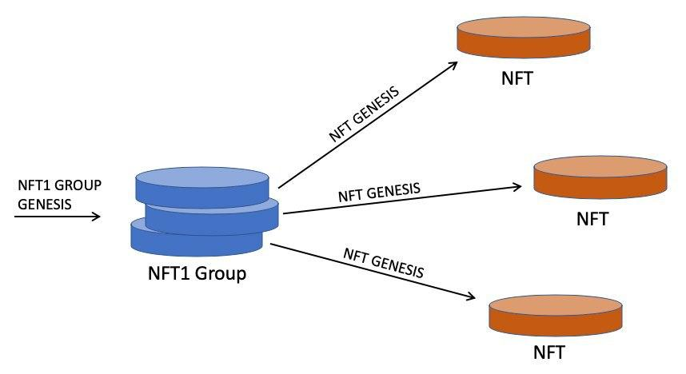

# Non Fungable Tokens (NFT)

The examples in this directory show how to generate and work with Non-fugable
Tokens (NFTs) using the [NFT1 Specification](https://github.com/simpleledger/slp-specifications/blob/master/slp-nft-1.md).

- [This YouTube Video](https://www.youtube.com/watch?v=vvlpYUx6HRs) walks through the examples in this folder.

## NFT Workflow

The workflow of NFT tokens using SLP and the NFY blockchain can be non-intuitive. The image above is an example of the workflow. Here are the steps to generating an NFT token:

1. An NFT 'Group' token is created first. This is not an NFT itself, but the raw ingredient from which an NFT is created. This is analogous to a stem cell, which is a cell that has not yet chosen to be a specific type of cell (like bone, blood, or nerve cell), but has the potential to become any of them.

2. NFT Group tokens can be created, minted, and sent just like any other kind of SLP token. The reason these are called a 'Group' token is that they represent a class or group of NFTs. So a Group might represent a class of items like swords, paintings, or concert tickets.

3. A NFT Child token is generated by consuming an NFT Group token. NFT Children are the actual NFT tokens and represent specific things with that class, like Excalibur (a sword), the Mona Lisa (a painting), and Row B seat 24 (a concert ticket).

4. NFT Children can be created and sent, but they can not be minted like other SLP tokens.

## Examples
The following workflow is recommended for working your way through the examples in order to learn about working with NFT tokens:

- [Create an NFT Group token](./create-nft-group)
- [Send an NFT Group token](./send-group)
- [Create an NFT Child by consuming an NFT Group token.](./create-nft-child)
- [Send an NFT Child token](./send-child)
- [Mint another NFT Group token in order to create more NFT Child tokens.](./mint-nft-group)
